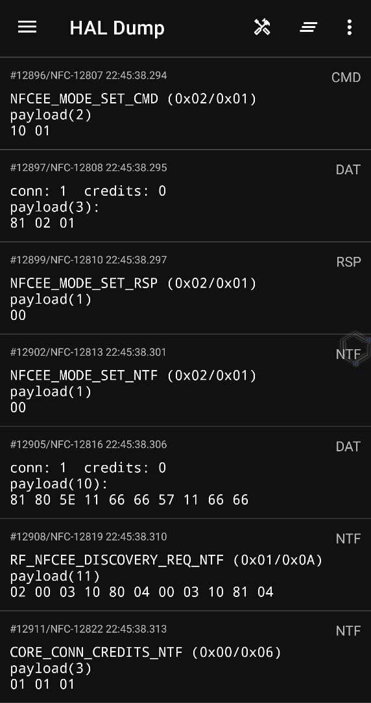

# NCI Host

## PROJECT DISCONTINUED

Because of the unavailability of the NQ2xx/NQ3xx/SN1xx/SN2xx Secure Element document due to the
NXP's no disclosure agreement as well as the QSEE TEE environment, the MIFARE Emulation is hard to
implement, so that the project is discontinued.

You may clone the repository and carry on the development if you are interested in the project.

### Features

- [x] RAW NFCC NCI communication capture
- [x] Send RAW NCI commands to the NFC Controller
- [x] NCI communication packet decoding
- [x] Disable NFC tag discovery sound(Xposed)

### TODO List

- [ ] MIFARE Classic card emulation(eSE/PN532/Proxmark3)
- [ ] eSE/TEE(QSEE) communication capture
- [ ] Proxmark3/PN532 OTG support
- [ ] Auto device detection

### Compatible Devices

- [x] /dev/nq-nci (NFCC, NQ330, SN1xx)
- [ ] /dev/qseecom (eSE, QSEE)

### Screenshots

